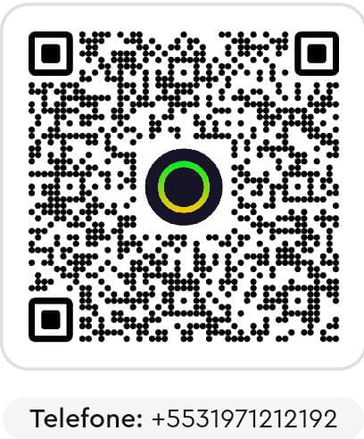

# Apoie o Crono Matrix

O Crono Matrix é desenvolvido e mantido de forma independente. Se o projeto
for útil para seu trabalho, você pode contribuir voluntariamente via PIX pelo
QR exibido nas interfaces Web e CustomTkinter.

## Antes de confirmar

- confira o nome do destinatário exibido pelo aplicativo bancário e só confirme
  se reconhecer o beneficiário; o nome bancário pode diferir do usuário GitHub;
- confira o valor antes de autorizar a transação;
- nunca informe senha, token, código de autenticação ou chave privada;
- uma doação não compra suporte, garantia ou prioridade;
- todos os recursos permanecem disponíveis independentemente de contribuição.

O QR é um recurso local estático. Exibi-lo não realiza conexão de rede, não
inicia pagamento e não coleta telemetria. Na interface Web, clicar na miniatura
abre o mesmo arquivo em tamanho original; no desktop, abre uma janela local
ampliada.

## Licença e doações

Doações não alteram os termos da [Apache License 2.0](../LICENSE). O software é
fornecido sem garantias, conforme as condições da licença.
